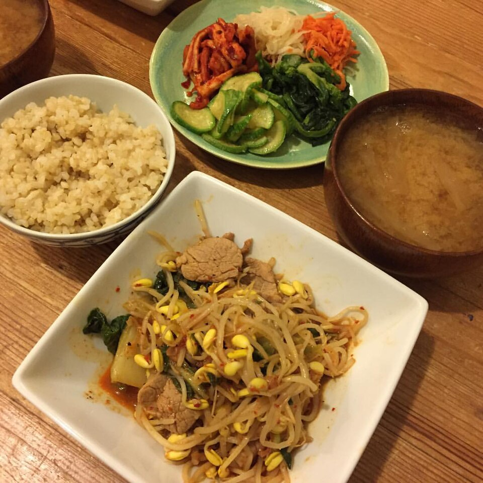

# 삼겹살 숙주 볶음 (15분 · 2인분)

삼겹살에서 나온 기름에 숙주를 잠깐 볶아낸다. **오래 볶지 않는 것이 전부.**

## 재료

| 꼭 필요한 것 | 양 | 있으면 좋은 것 | 양 |
|---|---|---|---|
| 삼겹살 | 200g | 칠리소스 | 조금 |
| 숙주나물 | 1봉지 | 청양고추 | 1개 |
| 대파 | 1/2대 | 통깨 | 조금 |
| 다진 마늘 | 1큰술 | | |
| 간장 | 1.5큰술 | | |
| 굴소스 | 1큰술 | | |
| 참기름 | 1작은술 | | |
| 후추 | 조금 | | |

## 만드는 법

| 시간 | 할 일 |
|---|---|
| 0–3분 | 숙주를 헹궈 **물기를 완전히 뺀다**. 삼겹살은 한 입 크기, 대파는 어슷썰기. |
| 3–8분 | **기름 없이** 센 불에 삼겹살을 굽는다. 나온 기름은 한 숟갈만 남기고 버린다. |
| 8–10분 | 대파·마늘 30초 → 간장·굴소스. **간은 여기서 끝낸다.** |
| 10–13분 | 센 불 그대로 숙주 넣고 **1~2분만**. 뚜껑 덮지 않는다. |
| 13–15분 | 불 끄고 참기름·후추·통깨. 바로 담는다. |

## 요령

- ⭐ **칠리소스를 곁들이면 잘 어울린다.** 매콤달콤한 맛이 기름을 잡아준다.
- **숙주는 마지막에 아주 잠깐만.** 실패 원인은 거의 이것 하나 — 오래 볶으면 물이 나오고 흐물해진다.
- 팬은 뜨겁게, 불은 세게. 약한 불이면 찜이 된다.
- 남은 것은 다시 볶지 말고 그대로. 데우면 숨이 죽는다.
- 매운 것을 좋아하면 청양고추를 대파와 함께.

---

사진 — [Pork, kimchee, and bean sprout stir fry](https://commons.wikimedia.org/wiki/File:Pork,_kimchee,_and_bean_sprout_stir_fry,_assorted_Korean_sides,_miso_soup_with_daikon_radish,_brown_rice_%E8%B1%9A%E3%83%92%E3%83%AC%E3%81%A8%E3%82%AD%E3%83%A0%E3%83%81%E3%81%A8%E3%82%82%E3%82%84%E3%81%97%E7%82%92%E3%82%81%E3%80%81%E9%9F%93%E5%9B%BD%E6%83%A3%E8%8F%9C%E3%80%81%E5%A4%A7%E6%A0%B9%E3%81%AE%E5%91%B3%E5%99%8C%E6%B1%81%E3%80%81%E7%8E%84%E7%B1%B3.jpg), 촬영 naotakem, [CC BY 2.0](https://creativecommons.org/licenses/by/2.0/), Wikimedia Commons. (숙주 대신 콩나물로 만든 비슷한 요리)
