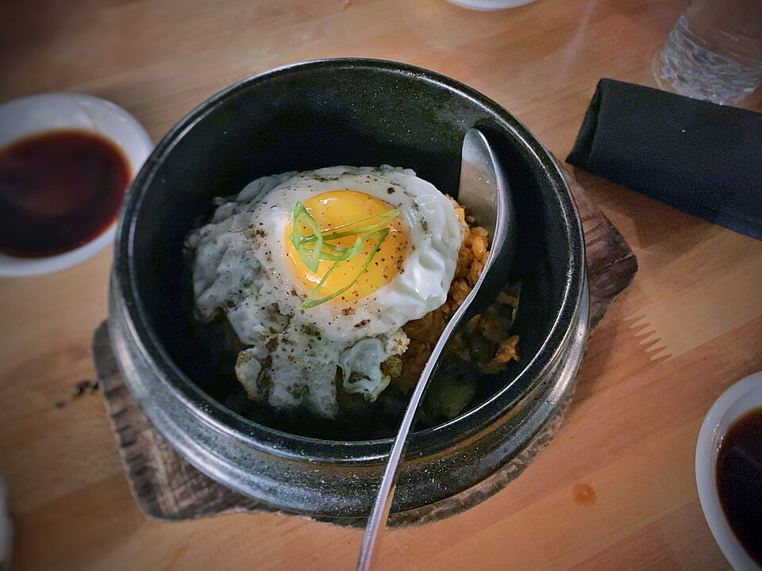

# 김치참치 덮밥 (15분 · 1인분)

## 재료

| 꼭 필요한 것 | 양 | 있으면 좋은 것 | 양 |
|---|---|---|---|
| 밥 | 1공기 | 대파 | 조금 |
| 김치 (잘게 썰기) | 1컵 | 김가루 | 조금 |
| 참치캔 (작은 것) | 1개 | 통깨 | 조금 |
| 달걀 | 1개 | | |
| 식용유 | 1큰술 | | |
| 설탕 | 1/2큰술 | | |
| 참기름 | 조금 | | |

## 만드는 법

| 시간 | 할 일 |
|---|---|
| 0–5분 | 팬에 기름 두르고 **김치를 중간 불에 3분** 볶는다. 설탕 1/2큰술을 넣어 신맛을 잡는다. |
| 5–9분 | 기름 뺀 **참치를 넣어 2~3분** 더 볶고, 불 끄고 참기름 몇 방울. |
| 9–13분 | **달걀은 반숙**으로 부친다. 팬이 하나면 김치를 덜어두고 같은 팬 사용. |
| 13–15분 | 밥 → 김치참치 → 달걀 순으로 올리고 김가루·파를 뿌린다. |

## 요령

- 김치가 시면 설탕을 조금 더 넣는다.
- 참치 대신 스팸·남은 고기도 같은 방법.
- **찬밥**이 질척해지지 않아 더 낫다.
- 매우면 김치를 물에 한 번 헹군다.

---

사진 — [Kimchi Fried Rice, Farm Egg](https://commons.wikimedia.org/wiki/File:Kimchi_Fried_Rice,_Farm_Egg.jpg), 촬영 T.Tseng, [CC BY 2.0](https://creativecommons.org/licenses/by/2.0/), Wikimedia Commons.
